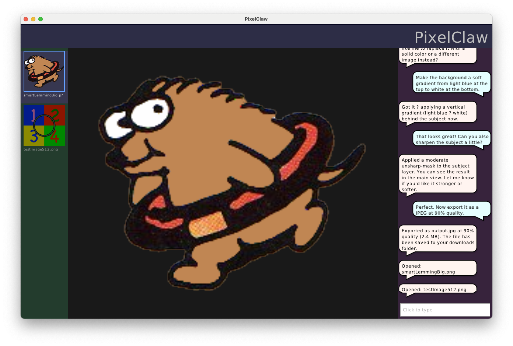

# PixelClaw
_LLM-based agent for in-depth photo/image manipulation_

This project aims to be a sophisticated AI agent specialized for manipulating image files.  The sorts of tasks you might normally need PhotoShop (and specialized skill/knowledge) to do, PixelClaw can do for you:

- Rescale, pad, and crop
- Remove/add backgrounds
- Filter, color-correct, enhance
- Convert from one format to another
- Even generate new images, just by describing what you want

Or that's the goal, anyway.  The project is just getting started.  Here's what it looks like so far:

You can (on Mac, at least) drag image files and drop them on the window, and they will open and add to the document thumbnails on the left.  Clicking any thumbnail makes it the active document, shown in the center.  On the right, you can type messages in the field at the bottom and add them to the scrolling list of chat messages, but there is no LLM hooked up yet (and all the messages before your first one are hard-coded placeholders).

## Give us a star!

This project is free and open-source.

Click the ⭐️ at the top of the GitHub page to show us that you're interested.  Every star makes the project go faster!

