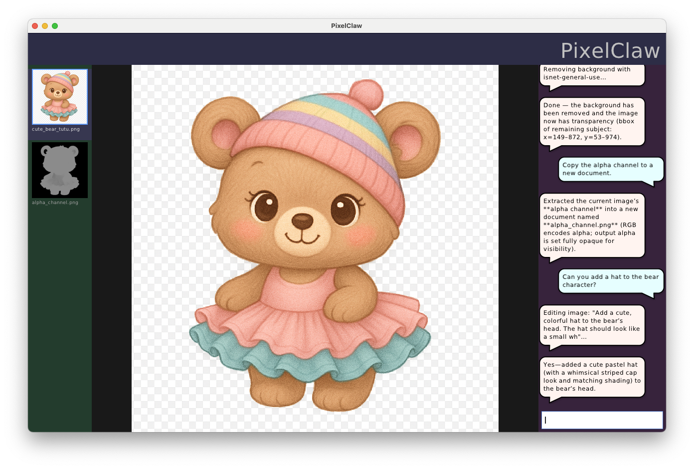

# PixelClaw
_LLM-based agent for in-depth photo/image manipulation_

This project aims to be a sophisticated AI agent specialized for manipulating image files.  The sorts of tasks you might normally need PhotoShop (and specialized skill/knowledge) to do, PixelClaw can do for you:

- Rescale, pad, and crop
- Remove/add backgrounds
- Filter, color-correct, enhance
- Convert from one format to another
- Even generate new images, just by describing what you want



That's not a mock-up; this was an actual image editing session done with PixelClaw.  See the [screenshots](screenshots/) folder for more.

## Installation

> **Platform note:** PixelClaw currently runs on macOS only. Windows and Linux support is planned.

**Prerequisites:** [Micromamba](https://mamba.readthedocs.io/en/latest/installation/micromamba-installation.html) (or Conda/Mamba).

```bash
# 1. Clone the repo
git clone https://github.com/JoeStrout/PixelClaw.git
cd PixelClaw

# 2. Create the environment
micromamba env create -f environment.yml

# 3. Run the app
micromamba run -n pixelclaw python -m pixelclaw.main
```

On first launch you will be prompted for your OpenAI API key (see below), and some features will download model files the first time they are used (see Runtime Downloads).

## API Key Required

Image generation and editing rely on network access to GPT-image-1; the agent LLM is currently using gpt-5.4-nano.  Both require an OpenAI API key.  This must be stored in either a file called `api_key.secret` at the project root, or an environment variable called `OPENAI_API_KEY`.

## Runtime Downloads

Some features download large files on first use. Nothing is downloaded until you actually invoke the feature.

| Feature | What | Size | Location |
|---|---|---|---|
| Speech-to-text | Whisper base.en model | ~145 MB | `~/.cache/huggingface/hub/` |
| Text-to-speech | Kokoro-ONNX model + voices | ~300 MB | `~/.cache/kokoro-onnx/` |
| Background removal | rembg model (varies by model choice) | 100–370 MB | `~/.cache/huggingface/hub/` |
| Image generation / editing | GPT-image-1 (OpenAI API) | — | network only |

## Give us a star!

This project is free and open-source.

Click the ⭐️ at the top of the GitHub page to show us that you're interested.  Every star makes the project go faster!

